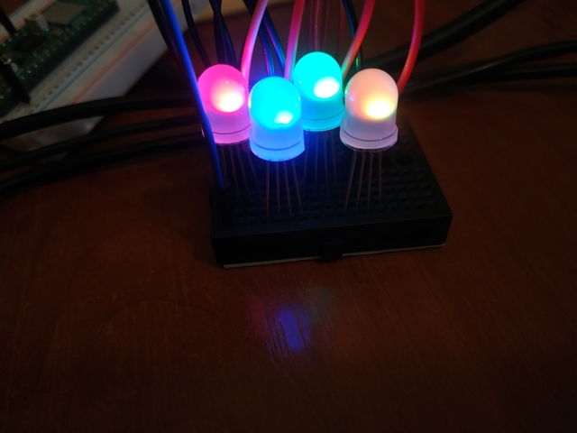
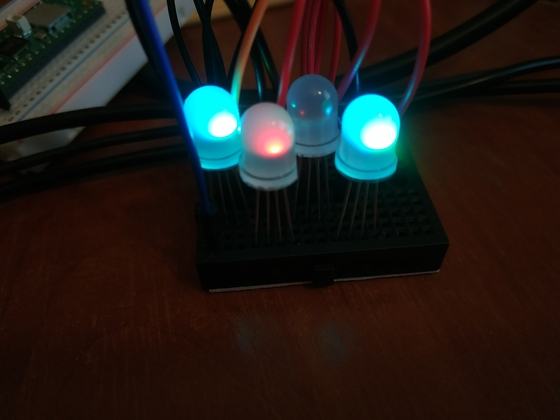
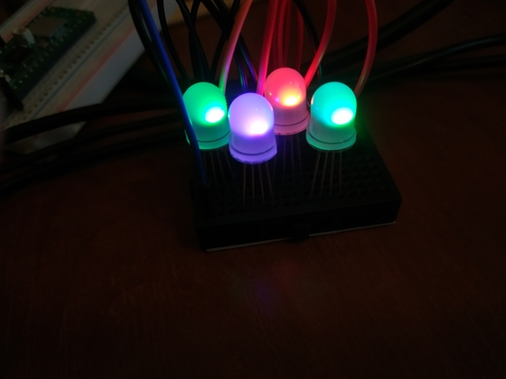

## Schematics

Schematic that has been used is [here](../../schematics/rgb-led.md).
Programmable pin used is 22.

## Programs

### original_example.py

Program taken from internet, code is not written optimally, but has interesting methods implemented.

### easy_example.py

Requires [rgb_led.py](../../libraries/rgb_led.py) library to be uploaded to pico.

Shows how to use [rgb_led.py](../../libraries/rgb_led.py) library.

### [rgb_led_loop.py](rgb_led_loop.py)

Requires [rgb_led.py](../../libraries/rgb_led.py) library to be uploaded to pico.

Shows how to use [rgb_led.py](../../libraries/rgb_led.py) library in a more complex example.

Though this complex is still not as complex as original_example.py.

### [thermometer_rgb_led.py](thermometer_rgb_led.py)

Requires [rgb_led.py](../../libraries/rgb_led.py) library to be uploaded to pico.

Doesn't work perfectly, but shows different colors depending on temperature between 15 and 25 Celsius.

