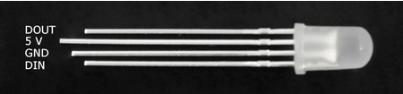
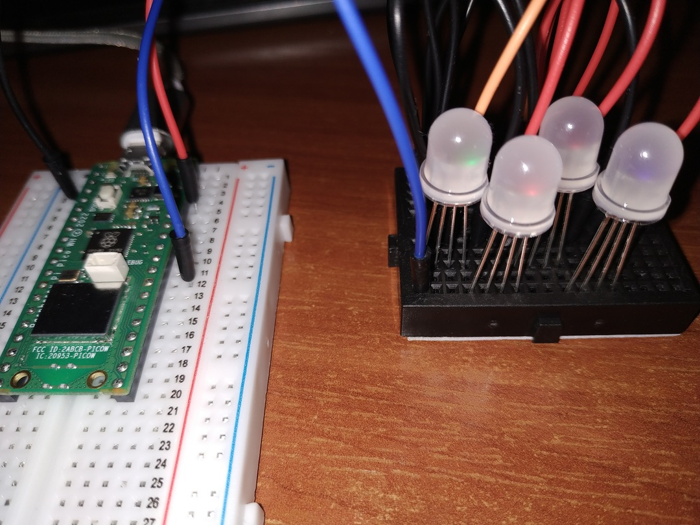

# Diode LED RGB WS2811

## Requirements
* 4 x RGB LED
* 100ohm resistor
* 3 long wires
* 8 short wires

## Circuit

Connect diodes in a way that DOUT of diode n is connected to DIN of diode n+1. Connect DIN of the first diode to the board. 

Each diode needs to be connected power supply (5V) and ground.

I've used 3.3V OUT power supply and it works ok.

## Photo

